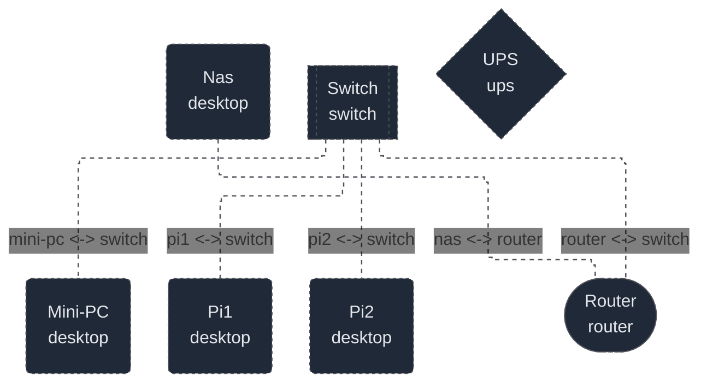

# Homelab

This repository contains most of the tools and configuration used to set up,
bootstrap, and operate my homelab. It combines host provisioning with Ansible,
a k3s Kubernetes cluster, Argo CD-managed applications, Helm values, standalone
Docker Compose workloads, and supporting automation scripts.

## Homelab topology



## Repository layout

```text
.
├── ansible
│   ├── group_vars
│   │   └── all
│   └── roles
│       ├── common
│       │   ├── defaults
│       │   └── tasks
│       ├── development
│       │   ├── defaults
│       │   └── tasks
│       ├── docker
│       │   ├── defaults
│       │   └── tasks
│       ├── ebpf
│       │   ├── defaults
│       │   └── tasks
│       ├── golang
│       │   ├── defaults
│       │   └── tasks
│       ├── helm
│       │   ├── defaults
│       │   └── tasks
│       ├── k3s_agent
│       │   ├── defaults
│       │   ├── handlers
│       │   ├── tasks
│       │   └── templates
│       ├── k3s_common
│       │   ├── defaults
│       │   └── tasks
│       ├── k3s_server
│       │   ├── defaults
│       │   ├── handlers
│       │   ├── tasks
│       │   └── templates
│       ├── kubectl
│       │   ├── defaults
│       │   └── tasks
│       └── rust
│           ├── defaults
│           └── tasks
├── argo
│   ├── applications
│   ├── values
│   │   ├── jellyfin
│   │   └── monitoring
│   └── workloads
│       ├── homepage
│       ├── jellyfin
│       ├── monitoring
│       ├── rackpeek
│       └── traefik
├── bootstrap
│   └── argocd
├── docker
├── helm
│   └── argocd
└── scripts
    └── argocd

60 directories
```

## Main directories

### `ansible/`

Ansible inventory, shared variables, playbooks, and reusable roles for
provisioning Debian/Ubuntu hosts. The roles install the common administration
toolset and development environment, Docker, Go, Rust, eBPF tooling, kubectl,
and Helm. The k3s roles bootstrap and manage the Kubernetes server and agent
nodes separately from general host provisioning.

### `argo/`

The desired Kubernetes application state reconciled by Argo CD. It contains
Argo CD `Application` resources, chart values, raw workload manifests, storage
configuration, monitoring resources, and Traefik routes for homelab services.

### `bootstrap/`

The small amount of configuration that must be applied before GitOps can take
over. The root Argo CD application in this directory connects the cluster to
the application definitions under `argo/`.

### `docker/`

Docker Compose definitions for services that can run directly on a Docker
host, independently of the k3s cluster. These currently cover Jellyfin,
Pi-hole, and qBittorrent.

### `helm/`

Helm configuration used to install or configure foundational cluster services.
At present it contains the values used for the initial Argo CD installation.

### `scripts/`

Operational helper scripts. The Argo CD scripts install and remove Argo CD and
configure its Git repository credentials. `multipass-lab.py` creates a
disposable local multi-node environment for testing the Ansible and k3s setup.

